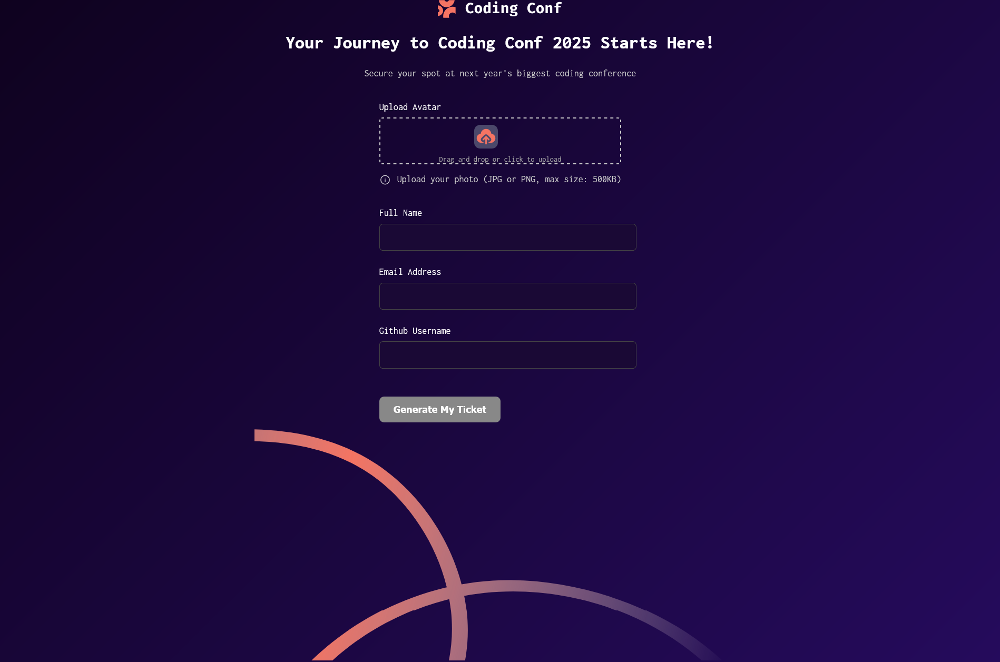
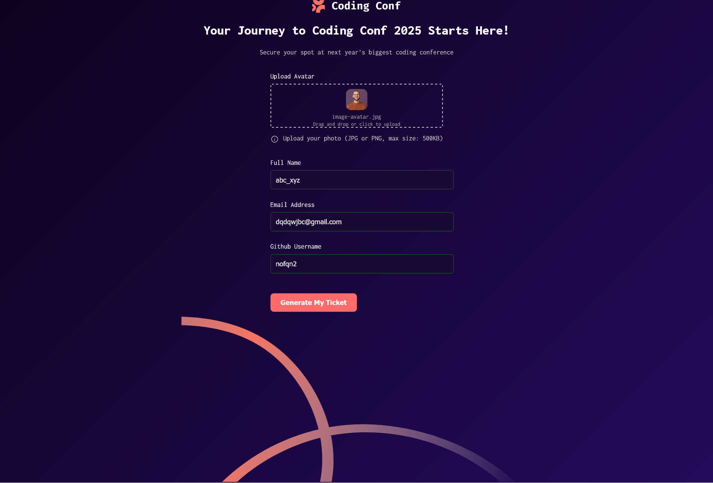
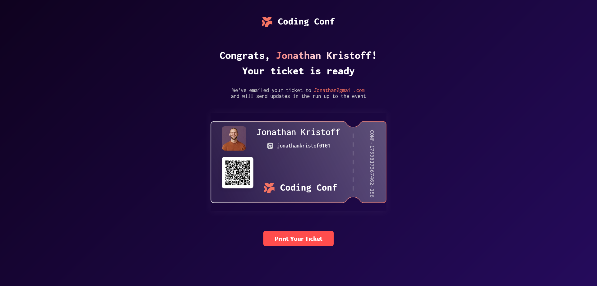

# Frontend Mentor - Conference ticket generator
- It features a complete registration flow with field validation, GitHub integration, local storage, avatar upload, QR code generation, and a printable ticket.

## Deployed using Netlify
- URL - https://effervescent-quokka-48b220.netlify.app/

## Features 
- Form
  - Required fields checked - Ensures no field is left empty.
  - Avatar upload validation – Checks file type and size (image-only and within limit).
  - Email validation – Regex-based validation for proper email format.
  -  GitHub username validation – Regex-based
  -  Real-time verification using the GitHub API.
  - Local Storage Integration
    - All valid input data is securely stored in the browser's localStorage.
    - Data is retrieved and reused to generate the final ticket after form submission.
- Final Ticket on submit
  - Unique Ticket ID – Auto-generated using timestamp or UUID pattern.
  - Avatar Display – Avatar image uploaded by user is shown on the ticket.
  - Personal Info Display – Shows name, email, GitHub ID from the form.
  - QR Code Generation – Encodes all form data into a downloadable QR code.
  - Print Button – Clean print-ready version of the ticket.

- Tech Stack
  - HTML5, CSS3 (custom styling)
  - JavaScript (Vanilla JS only)
  - GitHub API (for username validation)
  - QRCode.js – QR code generator

