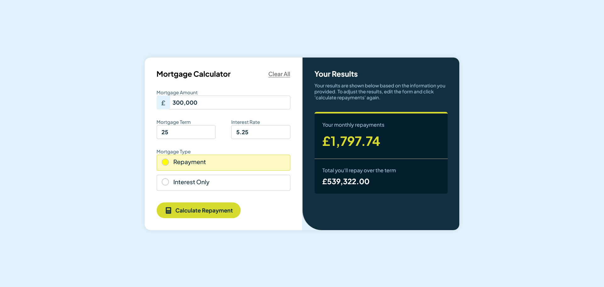

# Frontend Mentor - Mortgage repayment calculator
- An interactive **Mortgage Calculator** which allows users to calculate mortgage repayments based on different mortgage types (repayment or interest-only) and payment terms (monthly or overtime).

## 🚀 Features
- 📝 Input Form – collect user data such as mortgage amount, term, interest rate, and type.
- 🏦 Mortgage Types – calculate repayments for:
  - Repayment Mortgage → total + interest.
  - Interest-Only Mortgage → interest only.
- 🔄 Clear Input – reset all calculations with a single click.
- 🌍 Frontend Only – fast and lightweight, no backend required.

## Deployment
- Deployed using Netlify
- Live Demo - https://phenomenal-granita-eeae65.netlify.app/

## 🛠️ Tech Stack
- **HTML5** - structure and forms
- **Sass (CSS3 preprocessor)** – styling (variables, mixins, nesting)
- **Vanilla JavaScript (ES6+)** – mortgage logic & interactivity

## 🧮 Example Calculation
- **Inputs**
  - Mortgage Amount: £100,000
  - Interest Rate: 5% per year
  - Term: 10 years
- **1️⃣ Repayment Mortgage**
  - 👉 You pay back loan + interest over the term.
  - **Monthly Payment:** ~ £1,061.00
  - **Total Payment (Overtime):** ~ £127,320.00
- **2️⃣ Interest-Only Mortgage**
  - 👉 You only pay interest monthly, and the principal is due at the end.
  - **Monthly Payment (Interest Only):** ~ £416.67
  - **Total Interest (Overtime):** ~ £50,000.00
  - **Principal + Interest (Final Settlement):** ~ £150,000.00

  ## 📷 Screenshot
  - 

  ## 👩‍💻 Author
  - Aishwarya Gaikwad - [[https://github.com/aishwaryagaikwad21]]