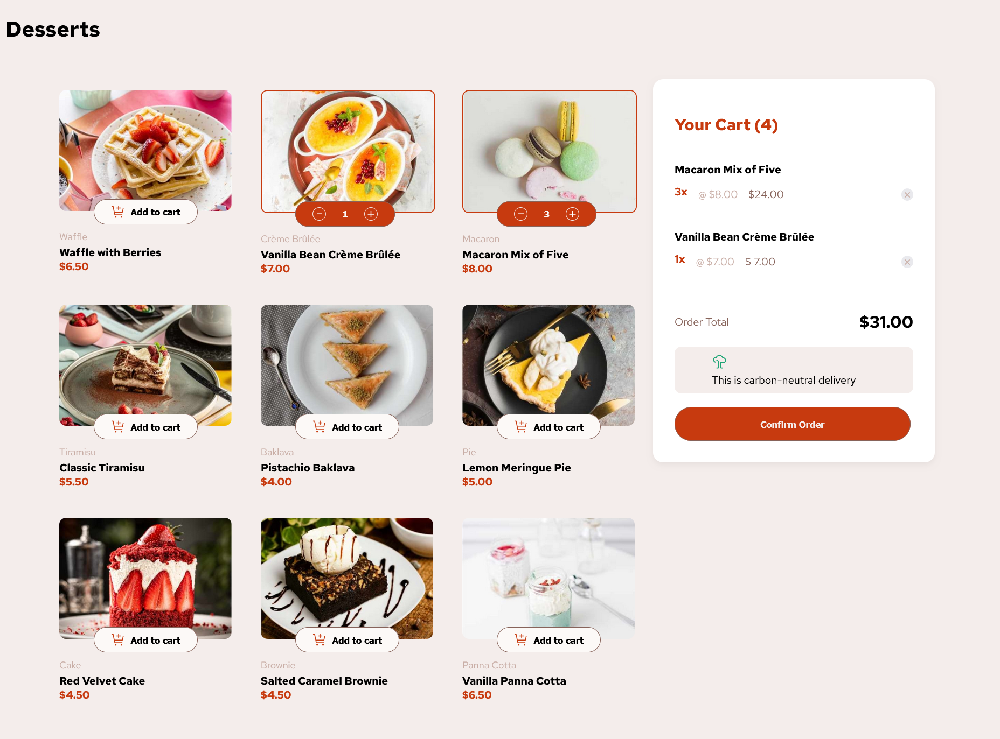
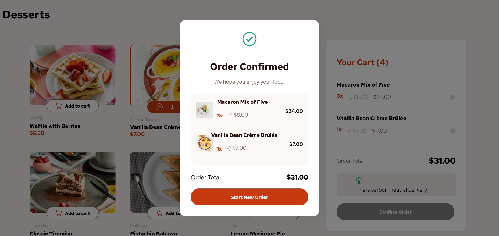

# Product List with cart
- A **Frontend Mentor** challenge where users can browse and purchase dessert items. Items can be added to or removed from a cart, with real-time updates to quantity, price, and total shopping cost.

🍰 **Live Demo** - https://dulcet-taiyaki-0f9be0.netlify.app/

## Features
- 🛒 Interactive Cart – Add or remove dessert items, and see totals update instantly.
- 📊 Dynamic Pricing – Displays item quantity, unit price, and total order cost.
- ✅ Order Confirmation – Smooth confirmation popup/alert with a "Start New Order" option.
- ⚡ Smooth Scrolling – Scrolls to the confirmation section upon placing an order.

## Tech Stack
- HTML5
- Sass (SCSS) – Modular, maintainable styles with variables and mixins.
- CSS3 – Styling and layout refinements.
- JavaScript (Vanilla) – Asynchronous programming, DOM manipulation, and JSON handling.

## What I Learned
- Loading and working with JSON data in a project.
- Asynchronous programming with fetch() and Promises.
- Advanced DOM manipulation for dynamic updates.
- Using Sass for cleaner, more reusable CSS.

## 🖼️ Screenshots 
- 
- 

## 👨‍💻 Author
- **Aishwarya Gaikwad**
- 🐙 GitHub: [@aishwaryagaikwad21](https://github.com/aishwaryagaikwad21)

